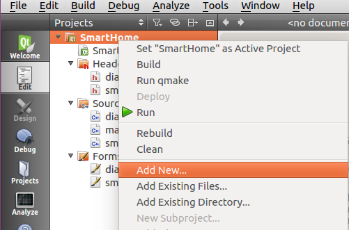
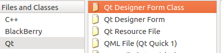
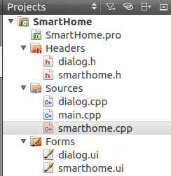
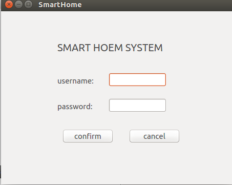
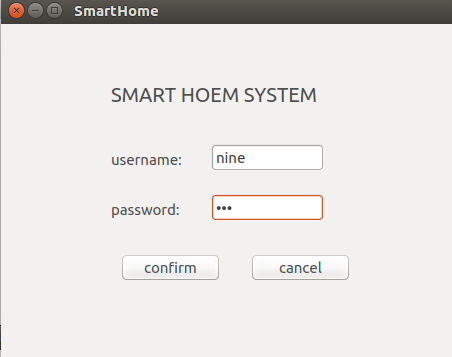
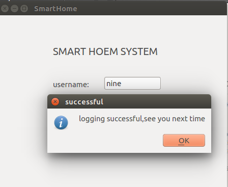
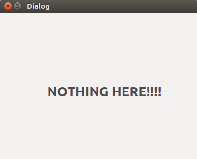
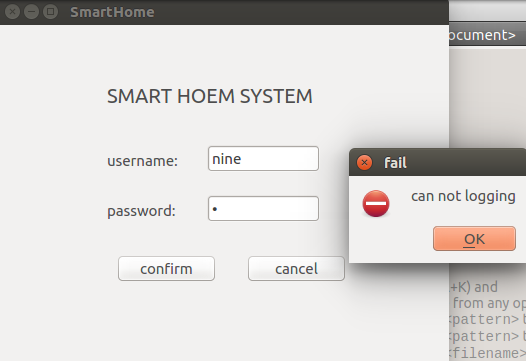

# 开发平台
## secureCRT
- 串口需要ch340驱动

## linux系统安装前置准备
- 由于使用miniusb口来烧写镜像，所以需要对miniusb进行驱动安装
    - 首先安装 驱动精灵 (小心安装和卸载时的勾选项)
    - 连接开发板和电脑，打开windows设备管理器
    - 在secureCRT的bootloader延时倒计时结束前键入`Enter`进入交互界面，然后键入`fastboot`，此时驱动精灵就会自动安装miniusb设备的驱动(因为该usb不是通用usb，需要开发板发送一个信息进电脑方可识别存在该usb)
    - 安装完毕后，可以在设备管理器发现`Android Device`，成功安装驱动
- 安装fastboot
    - 使用fastboot进行电脑与开发板的传输交汇
        - fastboot 并不是集成exe，无需安装
        - 如果需要全局使用fastboot，可以将fastboot文件夹内的内容全部复制到C:\Windows\System32和C:\Windows\SysWOW64中
        - 进入cmd，键入`fastboot`可查看命令

## linux系统安装
- 开发板与电脑连接后，商店开发板，在bootload延时结束前键入`Enter`进入交互界面
- 键入`fastboot`，此时开发板进入"系统更新模式"
- 系统更新
    - 将linux_bsp目录拷贝到电脑的某一位置
    - 打开dos终端，进入该目录
    - 执行以下命令
            fastboot flash ubootpak ubootpak.bin
            fastboot flash boot boot.img
            fastboot flash system qt-rootfs.img
    - 修改环境变量，键盘`ctrl+c`退出fastboot，执行以下指令
            #setenv bootcmd "ext4load mmc 2:1 0x48000000 uImage;bootm 0x48000000"
            #setenv bootargs "lcd=vs070cxn tp=gslx680-linux root=/dev/mmcblk0p2 rw rootfstype=ext4"
            #save

            如果用的是MIPI接口，则设置如下：
             #setenv bootargs "lcd=wy070ml tp=gslx680-linux root=/dev/mmcblk0p2 rw rootfstype=ext4"
             #save

    - 键入`re` 重启开发板

# QT初步体验
- **注意控件命名，方便使用**
## "LED"开关
- 点击QtCreator图标打开软件，
- 点击“New Project”新建一个工程：
选择`Application`->`Qt WIDgets Application`->点击`choose`
输入工程名称->修改工程安装目录->`next`
更改类名`Class name`->`next`->`finish`
配置工程属性：
点击`Projects`->取消勾选`Shadow build`

- 左侧`Edit`->`Froms`->点击`.ui`进入设计界面
拖动控件进行界面设计并为控件命名

回到初始化函数添加代码，把LED状态变为灰包

        ui->LED1_STATUS->setStyleSheet(QStringLiteral("background-color: rgb(100,0,0);"));
        ui->LED2_STATUS->setStyleSheet(QStringLiteral("background-color: rgb(100,0,0);"));
        ui->LED3_STATUS->setStyleSheet(QStringLiteral("background-color: rgb(100,0,0);"));

- 在ui设计模式中，右击`button`选择转到槽，选择`clicked()`->`OK`，进入函数编辑界面添加功能代码:
- 按下按键时改变LED状态

## 练习
- 完成布局后，添加新的界面
1.
2.
3.
4.添加代码(SmartHome.h中)
            private:
            Ui::SmartHome *ui;
            Dialog *w;	//加这一句
5.添加代码(SmartHome.cpp中)
            void SmartHome::on_confirmBtn_clicked()
        		{
            //获取文本框中的信息
            QString userInfo = ui->userNameTextEdit->text();
            QString pwdInfo = ui->passwordTextEdit->text();
            //登陆判断
            if(userInfo==NULL)
                QMessageBox::warning(NULL, "warning", "userName should not be NULL");
            else if(pwdInfo==NULL)
                QMessageBox::warning(NULL, "warning", "password should not be NULL");
            if(userInfo =="nine" && pwdInfo=="123")
            {
                QMessageBox::information(NULL, "successful", "logging successful,see you next time");
                this->close();	//关闭主界面
                w = new Dialog(this);	//实例化Dialog
                w->show();		//显示Dialig
            }
            else
            {
                QMessageBox::critical(NULL, "fail", "can not logging");
                ui->passwordTextEdit->clear();
            }
            }

            void SmartHome::on_cancelBtn_clicked()
            {
                this->close();
            }
- 运行

