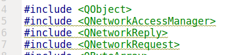
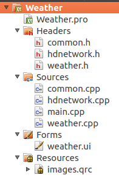
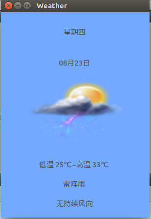

# qt交叉编译
- 注意用root 用户打开本ubuntu系统，否则要自己配qmake和compilers
- compilers中交叉编译器类型为GCC
- 交叉编译时在projects按钮的`add kits`中选择

# 可执行文件传输进开发板
- u盘挂载
		cat /proc/partitions
        mount /dev/sda1 /usb         (/usb自己创建)
    **问题描述**
    如果插入u盘出现
        [ 2200.637000] NTFS volume version 3.1.
        [ 2200.640000] NTFS-fs error (device sda1): 	load_system_files(): $LogFile is not clean.  Mounting read-only.  Mount in Windows.
    **解决**
    使用2.0接口而不是3.0接口的usb

- nfs模式
		mount -o nolock 192.168.x.xxx:/nfs /mnt
  **注意**
  x.xxx为虚拟机ip

  **问题描述**
  执行上述命令后，出现挂载卡住的情况

  **解决**
  可能是因为开发板和ubuntu*没有处在同一网段*，且ubuntu需要*桥接*
  ubuntu中`ifconfig`查看ip且记录网段，在开发板中键入`vi /etc/init.d/S70netconfig `,修改ip、网段、默认网关
  
- 运行
		./process -qws &
	- `-qws` 本应用为qt server，优先级高于默认的qt client
	- `&` 后台运行，可以使用`jobs`查看

## 天气
- 资源文件添加
在`images.qrc`->`open in edit`,`add prefix`后将默认的文件夹前缀改为`/`,对着文件夹右键`Add Existing FIles../Directory`选择要添加的图片

- 三个头文件问题
    **问题描述**
    出现

	**解决方案**
    在`.pro`文件下添加`QT += network`即可

- delay函数
	**问题描述**
    自己定义在xx.cpp中的delay函数无法在main函数中使用
    **解决方案**
    命名空间问题，只需要在delay函数前添加xx::即可
    如 `void Common::delay(unsigned int ms)`
- 五天问题
	**注意**list只装入了五天的数据

### 练习：整合天气显示模块和获取网络天气信息模块，循环显示获取的天气信息
- 框架

- 核心代码(main中)
        #include "weather.h"
        #include <QApplication>
        #include "hdnetwork.h"
        #include "common.h"

        int main(int argc, char *argv[])
        {
            QApplication a(argc, argv);
            Weather w;
            w.show();

            Common cm;	//存放Delay函数
            // get network data and save in local weatherlist
            HDNetwork* HttpNet = new HDNetwork();

            HttpNet->update_bus_weather();

            //wait
            cm.Delay(500);

            QList<WeatherData>list = HttpNet->get_weather();

            w.setStyleSheet("background-color:rgb(115,169,255)");	//设置背景颜色
            int end = 5;
            for (int i=0; i<end; i++)	//循环
            {
                WeatherData data;
                data.date = list.at(i).date;
                data.temp = list.at(i).temp;
                data.week = list.at(i).week;
                data.wind = list.at(i).wind;
                data.weatherinfo=list.at(i).weatherinfo;
                data.weatherpic=list.at(i).weatherpic;
                w.set_weather_info(data);

                cm.Delay(800);

                if (i==end-1)
                    i=0;

            }
            return a.exec();
        }
- 运行结果
