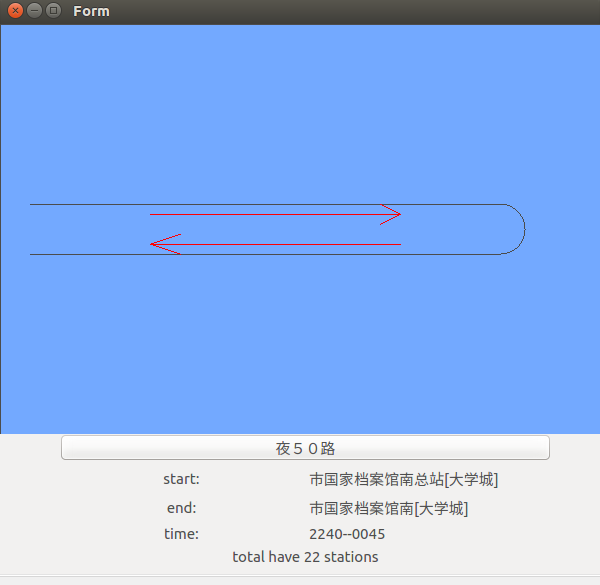

# day4 - SBS公交信息获取与显示

##公交经过站显示
创建一个工程继承QWidget类，通过绘图事件绘制站路径。

##公交列表显示
创建QWidget类工程，设计UI界面并添加函数实现

##公交站信息获取
- Qt通过http通信查询公交路线数据
- 解析Json数据获取路线信息
- 根据路线查询经过的站数据
- 解析路线的站数据存储在 BusData类对象中

##整合：将三个基本功能实验整合到一个工程包
		QList<BusData>list = HttpNet->get_bus_number();
该代码中list是一个BusData类型的列表，在后面告示牌以及路线图使用时可以直接使用(不过可以另外用一个相同类型的list保存，防止信息丢失)
- 想要做成以下效果(一个widget成为另一个widget的控件)

设置父对象即可，在main函数中**代码**如下

            Bus w;  //公告牌
            PathShowWin draw;   //路线图
            draw.setParent(&w);
            w.show();
- 整合**思路**
	- 围绕着BusData这个数据类型
        - `PathShowWin.setBusInfo(BusData);` 路线图需要
        - `  Bus.set_bus_station(BusData.station_des);`
`Bus.update();`  公告牌需要
		- `   QList<BusData>list = HttpNet->get_bus_number();` 恰好list就是BusData类型
		- 循环`list`这个变量就可以获得所有的公车信息，循环匹配list中的BusData.key_name就可以获得相应的公车路线
	- 设置外部变量，在按钮的槽函数中获得按钮的text()，且在main函数和槽函数所在cpp分别键入以下内容
		`QString name;`
        `extern QString name;`
        则可以将当前公车站名全局给main，main再循环匹配list中的BusData.key_name即可

- 整合**核心代码**
        while(1)	//无限循环
            for (int i=0; i<list.size(); i++)
            {
                cm.Delay(1000);	//循环循环间隔

                w.setBusInfo(list[i]);	//公告牌显示

                if(!(name.isEmpty()))	//不为空
                for (int i=0; i<list.size(); i++)//线路信息循环播放
                {
                    if (!(name.compare(list[i].key_name))) //线路名称不重复
                    {
                        draw.set_bus_station(list[i].station_des);//绘制站点名称
                        draw.update();//刷新触发绘图事件
                        name.clear();//清空name
                    }
                }
            }

**问题**
在ui文件右键转槽函数的方式可能会产生槽函数无响应的情况

**解决**
可能是转槽后改变控件名导致ui控件和槽函数的名字不匹配，可以
1.修改控件名，再转槽。注意需要在.h中删除之前的槽函数声明和在.c中删除之前的槽函数
2.将槽函数的控件名修改为当前的控件名

**注意**
**一个强劲的电脑可以加速开发和调试**
