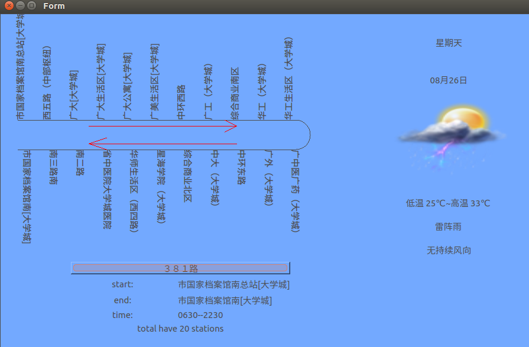

## 整合
**注意**
拷贝工程时需要注意将源代码文件夹中的`xxx.pro.user`删除，否则会同名工程编译运行紊乱。

## 将天气模块和公交车信息模块整合
- 整合思路
	- 为了方便，重新新建一个smartBus工程，以该工程的模版ui为蓝本来添加以后的模块ui
	- 将天气模块ui整合到公交车信息模块ui中，再将公交车信息模块ui整合添加进工程模版ui(利用setParent)
			Bus board;  //board
            PathShowWin draw;   //map
            Weather weatherMode;	//weather
            smartBus w;	//模版
            board.setParent(&draw);
            weatherMode.setParent(&draw);	//设置父对象
            weatherMode.move(600,0);	//移动位置
            weatherMode.setStyleSheet("background-color:rgb(115,169,255)");
            draw.setParent(&w);
            w.show();

    **问题**
    一开始模版为选择为mainwindows，模块使用时setParent无效
    **解决**
    没有注意到函数参数问题，setParent需要Qwidget*类型

	- 同屏显示中，为了达到board和weather可以同时循环显示，可以采用设置两个开始变量和两个结束变量，分别赋值0和各个list<>.size(); 再while(1)循环显示，在开始变量分别达到各自的结束变量-1时，重新赋值0
			int weatherStart = 0;
            int busStart = 0;
            int weatherEnd = listWeather.size();
            int busEnd = list.size();

            while(1)
            {
                cm.Delay(1000);

                board.setBusInfo(list[busStart]);
                weatherMode.set_weather_info(listWeather[weatherStart]);

                if(!(name.isEmpty()))
                    for (int i=0; i<list.size(); i++)
                    {
                        if (!(name.compare(list[i].key_name))) //same with route name
                        {
                            draw.set_bus_station(list[i].station_des);
                            draw.update();//flash to work draw event
                            name.clear();
                        }
                    }

                busStart++;
                weatherStart++;

                if (busStart == busEnd-1)
                    busStart=0;
                if (weatherStart == weatherEnd)
                    weatherStart=0;
            }
- 运行结果
