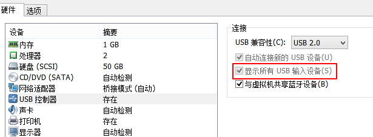
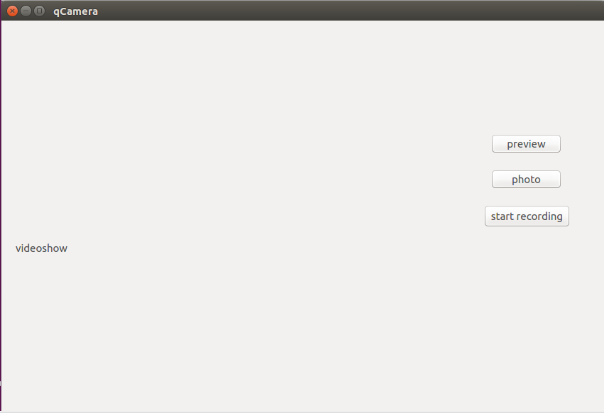
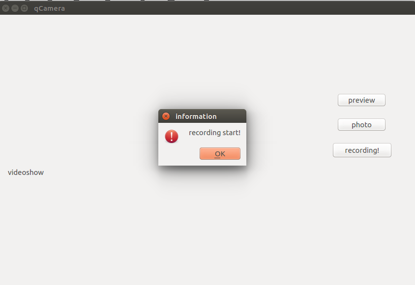
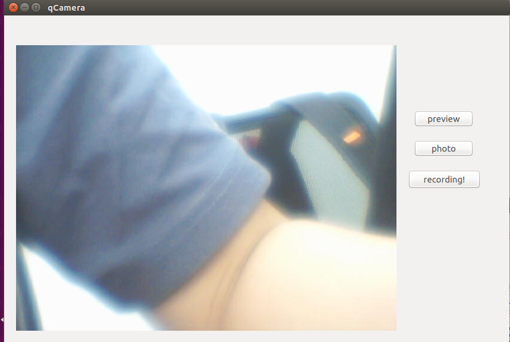
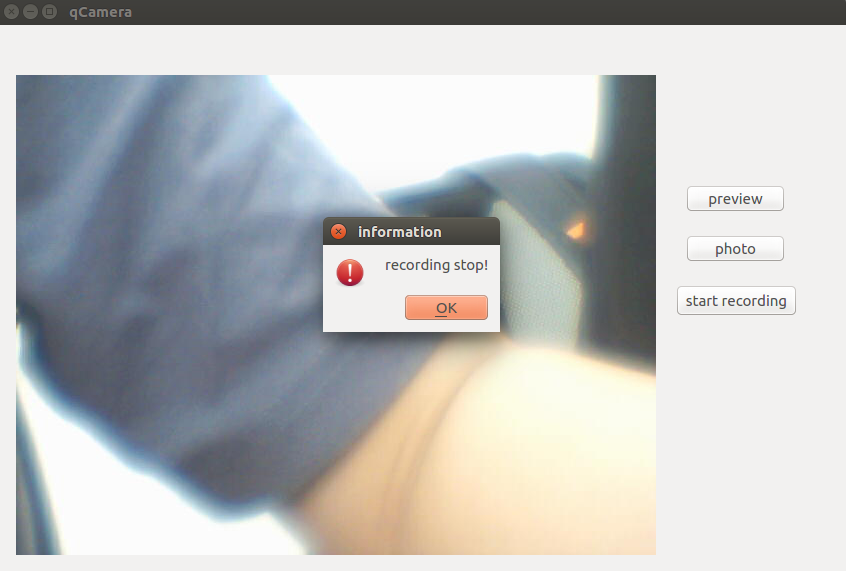

# v4l2视频监控
在QT的.pro中添加库

		LIBS += -L../qCamera/v4l2lib -lv4l2_ShareLib
在可执行文件当前目录已有v412lib和该目录下的库的前提下，提示找不到 libv4l2_ShareLib，改为

		LIBS += -L./v4l2lib -lv4l2_ShareLib
就可以了，怀疑和.pro.user有关

### 实现点击按钮时有提示且开始录制且开始保存，再次点击更改提示且结束录制且完成保存
- 思路：
1.利用一个变量flag，当奇数点击时，更改按钮控件text()和设置flag为1，否则更改按钮控件text为default文本和设置flag为0
2.flag为1时，新建保存文件，while(flag)循环使用`File.write((const char *)Frame.buf, Frame.length);`保存即可
**问题**
保存视频使用mplyaer播放速率很快
**解决**
`File.write((const char *)Frame.buf, Frame.length);`写多次即可
    **问题**
    找不到`/dev/video0`
    **解决**
    在不运行ubuntu情况下点击虚拟机->设置->usb控制器->勾上显示所有usb输入设备，开启ubuntu后插入摄像头，在ubuntu右下角一排图标找到一个camera图标(名字是Z–start pc camera)右击连接即可，还找不到就右击断开再连接
    
    and
    

- 代码：
        void qCamera::on_recording_button_clicked()
        {
            QString name = ui->recording_button->text();
            if (!(name.compare("start recording")))
            {
                ui->recording_button->setText("recording!");
                flag = 1;
            }
            else
            {
                flag = 0;
                ui->recording_button->setText("start recording");
            }
                if (flag)
                {
                    FreamBuffer Frame;
                    QString str = QString("/media/video/")+QDateTime::currentDateTime().toString("yyyy-MM-dd hh:mm:ss")+QString(".mp4");	//按照日期保存
                    File.setFileName(str);
                    if (!File.exists())
                    {
                        File.open(QIODevice::ReadWrite);
                    }
                    QPixmap pix;
                    QMessageBox::warning(this, "information","recording start!");
                    while(flag)
                    {
                         apiv412.linux_v4l2_get_fream(&Frame);
                         pix.loadFromData(Frame.buf, Frame.length);
                         ui->videoshow->resize(pix.size());
                         ui->videoshow->setPixmap(pix);
                         for (int i=0; i<2; i++)	//增加帧
                             File.write((const char *)Frame.buf, Frame.length);
                         cm.Delay(1);	//不延时会无法显示图形，但是保存视频不受影响
                     }
                    File.close();
                    QMessageBox::warning(this, "information","recording stop!");
                }
            }

- 运行

### 烧写进开发板
- .pro 代码更改
		LIBS += -L./v4l2_ShareLib_arm -lv4l2_ShareLib
**问题**
运行时候显示
			./qCamera: error while loading shared libraries: libv4l2_ShareLib.so.1: cannot open shared object file: No such file or directory
**解决**
使用软链接
    		ln -s /v4l2_ShareLib_arm/libv4l2_ShareLib.so1 ./
	- 此时再运行
   		 ./qCamera -lv4l2_ShareLib