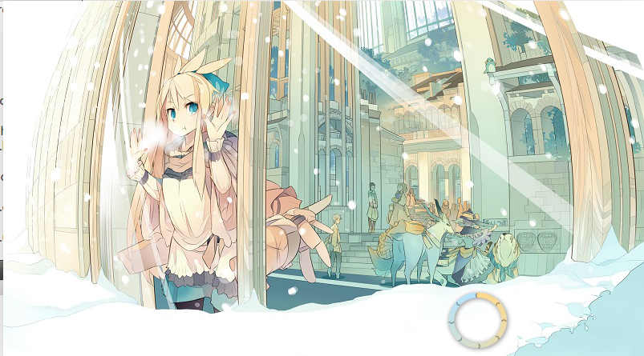
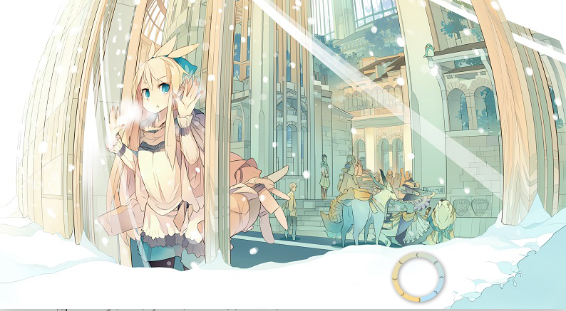
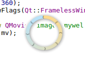
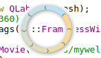

# QSplashScreen、QLabel、QMovie

- 利用QSplashScreen的(显示静态图片-等待-结束显示)的机制和QLabel+QMovie可以显示gif机制结合，变成(显示动态图片-等待-结束显示)的机制
- 核心思路
实例化一个QSplashScreen后，将它的地址作为参数传入QLabel的构造函数，QLabel设置完QMovie后，就可以启动QMovie和QSplashScreen了，然后在一个for循环中，随着QMovie的速率强制刷新内容即可完成全部内容。
**小小的问题**
QLabel不居中
**解决**
`setWindowFlags(Qt::FramelessWindowHint);`即可
        #include "welcome.h"
        #include <QApplication>
        #include <QSplashScreen>
        #include <QMovie>
        #include <QLabel>
        #include "common.h"
        int main(int argc, char *argv[])
        {
            QApplication a(argc, argv);

            Common cm;

            QPixmap pix("images/logo.jpg");
            QSplashScreen *splash = new QSplashScreen(pix);	//设置图片
            splash->setWindowOpacity(1);// 设置窗口透明度

            QLabel *label = new QLabel(splash);	//将QSplashScreen地址传入QLabel的构造函数
            label->move(550,360);	//移动位置
            label->setWindowFlags(Qt::FramelessWindowHint);	//QLabel无边框

            QMovie *mv = new QMovie("images/mywel.gif");
            label->setMovie(mv);	//设置动画

            mv->start();	//启动动画
            splash->show();	//启动QSplashScreen，QLabel也会跟着启动

            splash->setCursor(Qt::BlankCursor); //鼠标移动到QSplashScreen上时不显示鼠标光标

            for(int i=0; i<2000; i+=mv->speed())
            {
            a.processEvents();	//强制刷新内容
            cm.Delay(mv->speed());	//延时等待动画
            }

            // 结束后的内容
            welcome w;
            w.show();

            splash->finish(&w);

			//删除所有指针
            delete label;
            delete mv;
            delete splash;

            return a.exec();
        }

- 运行
	- 上述代码效果
    
    
    - 改为
    		QPixmap pix("images/mywel.gif");
            QSplashScreen *splash = new QSplashScreen(pix);	//设置图片
      同时注释掉
      		label->move(550,360);
      运行结果如下
      
      

