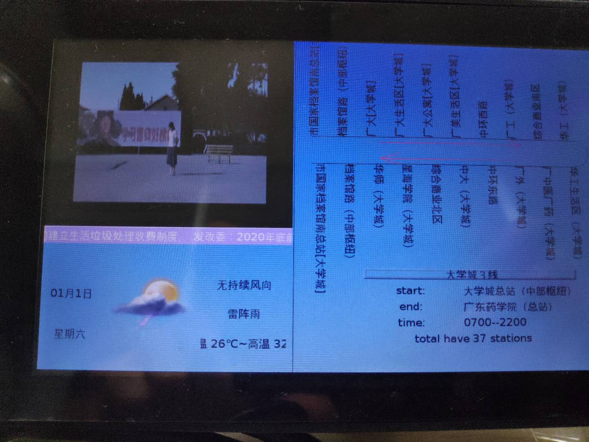

# 已有模块整合
1. 公车信息模块
2. 天气模块
3. 视频播放模块
4. 欢迎logo模块

- 整合思路
无他，将各个模块置于蓝本类上即可。

    **问题**
    mplayer在6818平台上默认播放位置无法改变（0,0）
    **解决**
    网上说这是因为mplayer的架构不一样，无法指定位置，只能修改源代码再重新编译，然而该问题可忽略，置换模版位置于左上角即可。

    **问题**
    mplayer播放时候尺寸会依照视频自己的比例显示而不是设置好的尺寸
    **解决**
    `cmd.append(QString("-zoom -x 420 -y 350 "));`传参无效，直接赋值即可。

    **问题**
    字体过大
    **解决**
    在main函数开头，可以设置全局的字体大小
    ```java
        QFont font = a.font();
        font.setPointSize(8);
        a.setFont(font);
    ```
- 运行

