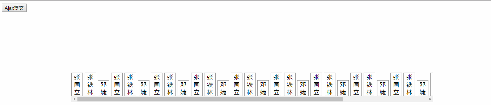

# web前端
- 安装webstorm和phpstudy
**注意**phpstudy需要用管理员身份运行

- 语法
    - 在`style`中可以使用css和js的超链接
    ` <link rel="stylesheet" href="css.css"> 外部链接css`
    `    `
    或者使用内嵌
    `#x{}`：id为x的属性
    `x.y{}`: x部件可用的y类的属性，x可为空
    
    
## 读取json文件并且显示在页面上，可水平滚动
- .html
        <!DOCTYPE html>
        <html lang="en">
        <head>
            <meta charset="UTF-8">
            <title>Title</title>

             载入jquery文件
             自定义js
            
        </head>
        <body>
        

            

                

                

                

                

                

                

                

                

                

                

                

                

                

                

                

                

                

                

                

                

                

                

                

                

                

                

                

                

                

                

                

                

                

                

                

                

            

        

        <input type="button" value="Ajax提交" onclick="Ajax();" /> 设置一个按钮，点击执行Ajax()函数

        </body>
        </html>
- .js
        var Ajax = function ()
        {
            var divArr = document.getElementsByClassName('Inter'); 获得所有类名为Inter的div
            for (var i=0; i<divArr.length; i++)
                divArr[i].innerHTML=""; 值置空
            var textNode;
            $.getJSON ("./userinfo.txt", function (data) 获得json数据
            {
                var jsonLength = data.length; 内容个数

                for (var i = 0; i < jsonLength; i++) {
                    textNode = document.createTextNode(data[i].name);
                    divArr[i].append(textNode); 逐一加入
                }
            });
        }

- 运行
点击前

点击后

json数据
